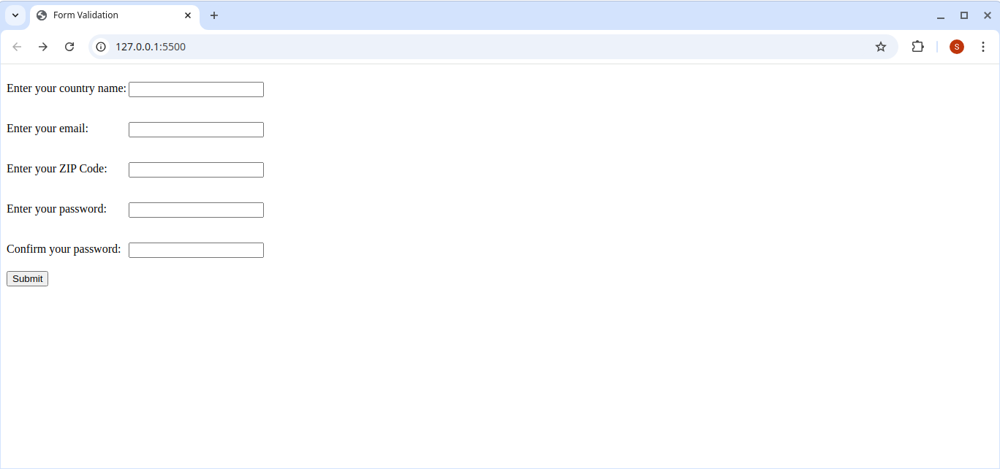
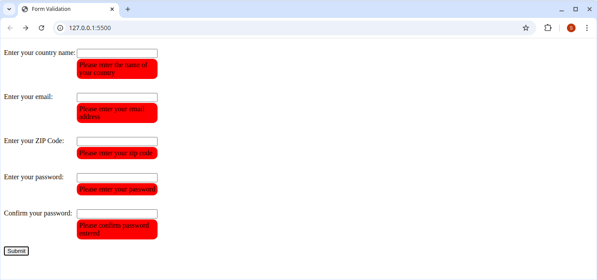
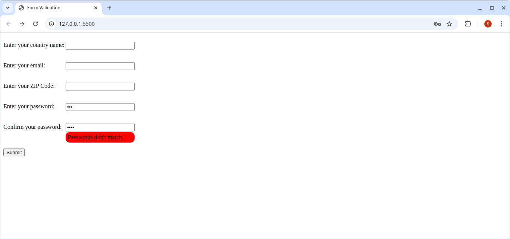
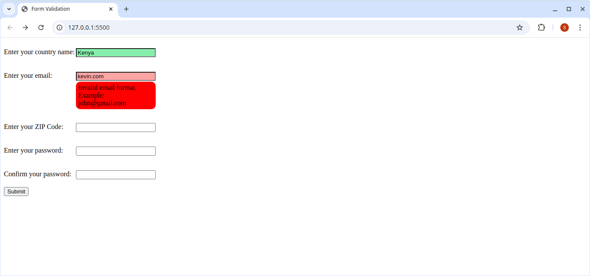
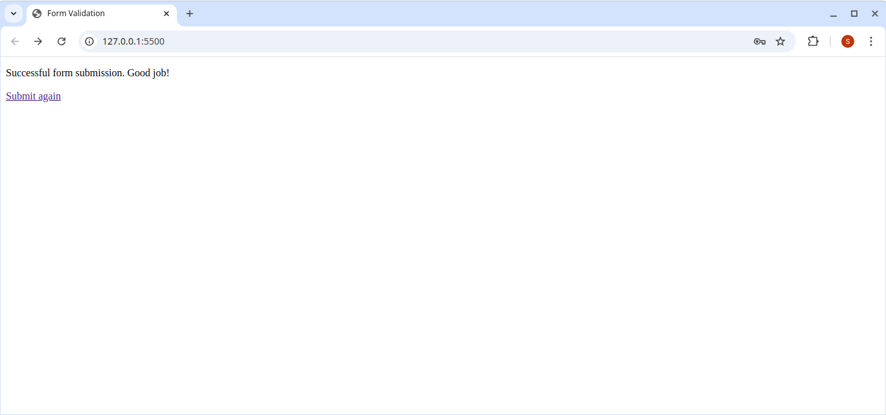

# validation-practice

## Table of Contents
- [Introduction](#introduction)
- [Features](#features)
- [Technologies Used](#technologies-used)
- [Live Preview](#live-preview)
- [Scrrenshots](#screenshots)
- [Lessons Learned](#lessons-learned)
- [Acknowledgments](#acknowledgments)

## Introduction
This project is part of The Odin Project curriculum where client-side form validation is put into practise using JavaScript and The Constraint Validation API for client-side form validation.

## Features
- **Client-side validation for blank inputs**: The form can not be submitted with blank values.
- **Email type validation**: Only accept address which are of email type. `Example: user@hostname`
- **Password matching validation**: Passwords which do not match can not be submitted.
- **Custom Error Message**: The error message are specific to help the user easily rectify the error.
- **Display Success Message**: If the user fills the form properly they recieve a message indicating success on form submission.
- **Color code inputs**: Use the color green for valid inputs and red for invalid inputs.

## Technologies Used
- **HTML**: Used for structure and form validation attributes.
- **CSS**: Used for styling and layout.
- **JavaScript**: Used for client side validation.

## Live Preview
- Try out the live preview [here](https://stephenasembo.github.io/validation-practice/)

## Screenshots
### Homepage

*Initial page on load. Empty form ready for user input*

### Blank Input Error

*Error displayed below each blank input*

### Wrong Email Format Error

*The email format needs to match a format such as: `user@hostname`*

### Wrong Password Confirmation Error

*Passwords need to match for the form to be submitted*

### Color Coded Inputs

*Green color for valid input and red for invalid input*

### Successful Form Submission

*Success message for successful form submission*

## Lessons Learned
- How to perform client side validation using JavaScript and Html attributes.
- Matching passwords through client side validation.
- Relaying custom error messages in real time.

## Acknowledgments
- This exercise is part of [The Odin Project](https://theodinproject.com) web development curriculum.